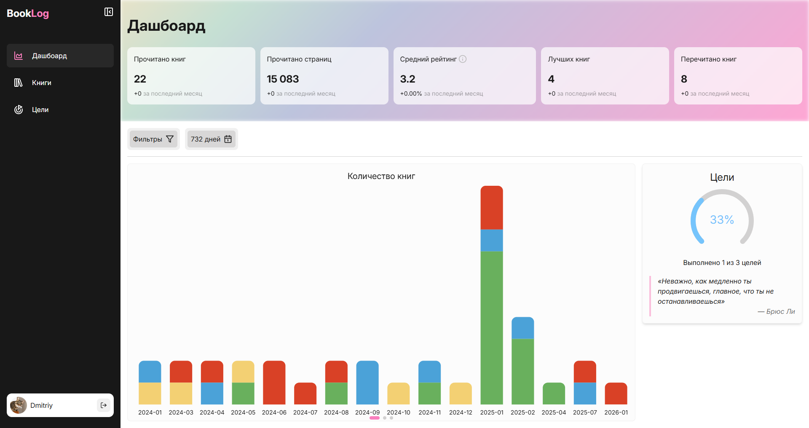
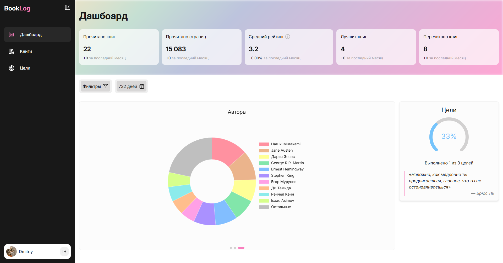
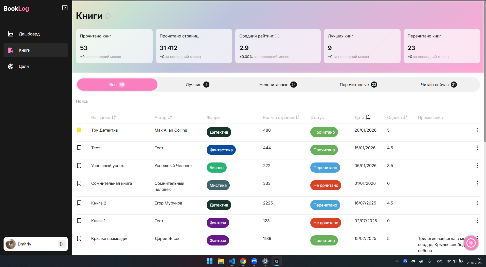
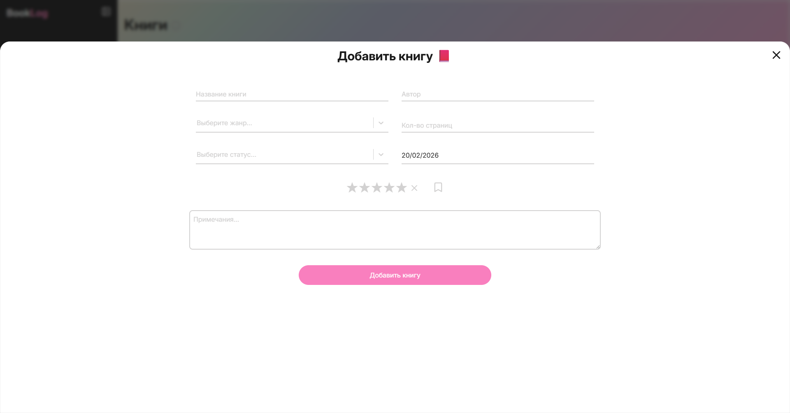
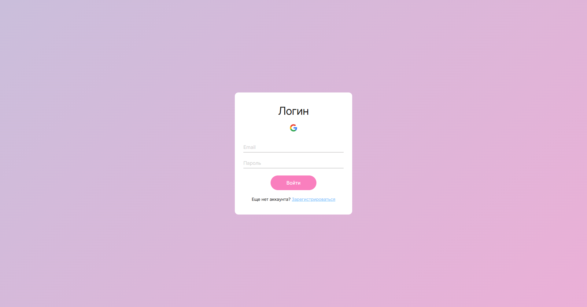

# 📚 BookLog

Удобный трекер для ведения списка прочитанных книг, отслеживания прогресса и планирования будущих покупок.

---

## 🚀 О проекте

BookLog создан с целью помочь в отслеживании прогресса чтения книг. Приложение поможет вести учет книг, выведет статистику книг/страниц/рейтинг/автор...

### Основные возможности:

- 📖 **Управление библиотекой**: добавление, редактирование и удаление книг.
- 🔍 **Поиск и фильтрация**: быстрый поиск по автору или названию.
- 📊 **Статистика и графики**: удобные графики и полная статистика вашей библиотеки.
- 🎯 **Цели и мотивация**: создавайте списки целей, можете создать список целей на этот год, неделю или месяц. В процессе выполнения целей будут выводится разные цитаты, которые помогут вам дойти до конца.
- 🔐 **Авторизация через Google**: быстрый и безопасный вход, в один клик, без необходимости запоминать лишние пароли.
- 📱 **Адаптивный дизайн**: удобно пользоваться как с компьютера, так и с телефона.
- ⚡️ **Real-time синхронизация**: ваши данные всегда актуальны. Любое изменение мгновенно отображается на всех устройствах — от ПК до смартфона — без перезагрузки страницы.

---

## 📸 Скриншоты

<table table-layout: fixed; width: 100%>
  <tr>
    <td align="center" width="50%">
       
      Дашбоард - Количество книг
    </td>
    <td align="center" width="50%">
       
      Дашбоард 2 - Авторы
    </td>
  </tr>
	<tr>
    <td align="center" width="50%">
       
      Книги
    </td>
    <td align="center" width="50%">
       
      Добавление книги
    </td>
  </tr>
	<tr>
    <td align="center" width="50%">
       
      Аккаунт
    </td>
    <td align="center" width="50%">
       
      Страница входа
    </td>
  </tr>
</table>

---

## ⚛️ Стек технологий

---

## 🔗 Live Demo

Приложение доступно по ссылке: **[thebooklog.vercel.app](https://thebooklog.vercel.app/)**

---

## 📧 Контакты

Автор проекта: [Егор Мурунов](https://github.com/YegorMurunov) | [Telegram](https://t.me/yegerchill)
